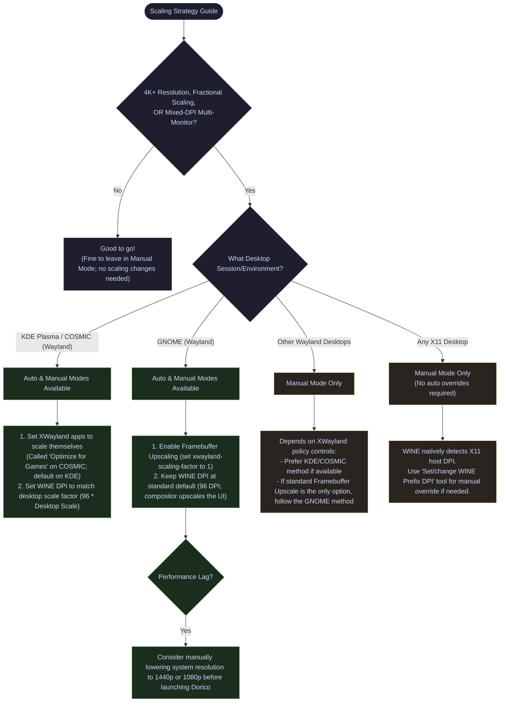

# Torquio
A unified installation framework for Dorico on Linux

## The Mission
This project aims to simplify the process of installing Steinberg's Dorico on Linux via WINE. Steinberg software has historically been difficult to run on Linux due in large part to installer complexity, account logins/license validation, including web-to-app token handoffs, and the like. Typically, if a user could get past these pain points, the software itself would run decently. 

To that end, our goal is to provide a **reproducible, automated, and user-friendly** deployment system.

---

## Prerequisites

Before running the installer, ensure your host system has the following installed:

1.  **Distrobox** (available in most standard repos) 
    - Optional addition: **Distroshelf** (a graphical frontend for managing Distrobox containers, available via Flathub)
2.  **Docker** or **Podman**
    - If you don't know which one to get, go with Podman. It's in the major repos and is therefore easier to install, and for most people they're functionally identical (the only people for whom the differences are material are people who already know which one they need).  

On many immutable distros, the above are included by default, so you're good to go. That includes:

* **The Universal Blue family** (Bazzite, Bluefin, Aurora, and most, if not all, custom downstream images)
* **SteamOS**
* **openSUSE Aeon / Kalpa**  

> [!TIP]
> On the upstream Fedora Atomic family (Silverblue, Kinoite, etc.), by default Podman is available, but Distrobox is not, in favor of Toolbox. To install Distrobox, we recommend the sudo-free install to your user's local binary folder:
>
>```
>curl https://raw.githubusercontent.com/89luca89/distrobox/main/install | sh -s -- -p ~/.local/bin/
>```
>
>as suggested here: [https://fedoramagazine.org/run-distrobox-on-fedora-linux/](https://fedoramagazine.org/run-distrobox-on-fedora-linux/). This is the "custom directory" install detailed on Distrobox's [installation page](https://github.com/89luca89/distrobox#installation).


## Step 1: Download Installers

You must provide your own Steinberg installers. 

Download the following files from the Steinberg download pages for [Steinberg Download Assistant](https://o.steinberg.net/index.php?id=steinberg_download_assistant&L=1) and [Steinberg MediaBay](https://o.steinberg.net/index.php?id=15368&L=1) to your `~/Downloads` folder:

*   `Steinberg_Download_Assistant_*_Installer_win.exe` (Mandatory)
*   `MediaBay_Installer_win64.zip` (Mandatory)
*   `NotePerformer-Installer-*.exe` (3rd-party, Optional)

*Note: You do not need to download the Dorico installer itself. The Download Assistant will handle that once the environment is built.*

## Step 2: Install & Build
Open your terminal and run the following commands to clone the repository and start the automated build process:

```bash
git clone https://github.com/snakeeyes021/torquio.git
cd torquio
./scripts/install.sh
```

*(You can append `-y` to `install.sh` to bypass the installer manifest confirmation prompt and scale prompts for a completely silent, automated installation).*

### What happens next?
The build pipeline automatically handles all the heavy lifting:
1. Configures an isolated Ubuntu container.
2. Compiles a custom version of WINE (with specific stubs required by Dorico).
3. Initializes a Windows prefix, applies ClearType font configurations, and installs core dependencies.
4. Installs MediaBay, the Download Assistant, and NotePerformer (if provided).
5. Registers all application desktop shortcuts and web-login handlers to your native Linux application menu.
6. Installs the globally accessible `torquio` console utility to manage your environment easily.

After installation, the Steinberg Download Assistant will launch automatically. Once the it does, simply sign in and download Dorico as you normally would! When finished, close the Download Assistant, run the Activation Manager to activate your license, and you are ready to start notating!

---

## The Torquio Console Manager

Torquio provides a unified, friendly console utility to manage your environment. You can run it globally from your terminal at any time simply by typing:

```bash
torquio
```

### Quality of Life Features

*   **Console Dashboard**: Displays the active status of your container dependencies, configuration preferences, and system details in a handy CLI interface.
*   **Automatic Scaling**: Automatically manages XWayland scaling policy/prefix DPI so that Dorico renders well given your monitor specs and settings.
*   **Project Folder Mapping**: Maps your native host folders directly into the WINE file picker using a convenient wizard so your projects are always easily accessible.
*   **Keyboard Shortcut Backups**: Saves or restores your custom Dorico keyboard shortcuts for convenient transport to and from other machines.
*   **One-Click Maintenance**: Provides quick menu items to run WINE configuration, edit the registry, open a file manager inside the prefix, soft-reboot the environment, or safely shut down the server.
*   **Startup Time Validation**: Warns you if the host system clock is out of sync, preventing tricky, hard-to-diagnose Steinberg licensing activation errors.
*   **Assorted Problem Fixes**: Solves several annoying quirks of running Dorico on Linux, such as keyboard longpresses not working right (breaking scrubber functionality) for instance.

---

## Display Scaling & Performance

Because Dorico runs via WINE (which currently operates on legacy X11 protocols via XWayland), high-resolution monitors can cause scaling headaches on modern Wayland desktop environments. 

If you use anything that is 1440p or below and you don't use desktop environment fractional scaling, you should be in the clear and don't really need to worry about this. However, if you use anything that's 4K or above, have a high DPI screen that requires fractional scaling, or you use Dorico on a laptop that sometimes gets plugged into a dock/monitor with a different DPI or desktop scaling factor from your laptop's screen, you may want to read on.

Torquio's **Auto Graphics Mode** attempts to solve these various scenarios by managing the desktop's XWayland scaling protocol as well as the WINE prefix's DPI setting. Auto Graphics Mode is available on recent Wayland versions of **GNOME**, **KDE Plasma**, and **Cosmic** (where it handles DPI *and* coordinates compositor scaling policies). On **X11 sessions**, Auto Graphics Mode and the Match Hardware Physical DPI options are not necessary, so the option is not available (WINE natively and accurately queries and utilizes the X server's dimensions and DPI at launch).

If your use case *does* fall into one of the above categories but you're not on a supported desktop environment (and could benefit from some direction on how to manage things) or you just want to know what's going on under the hood, here's a useful graph:



### Under the Hood: The Formulas

Depending on how your Desktop Environment scales legacy X11/XWayland applications, the target WINE DPI is calculated relative to a standard **`96 DPI`** logical baseline (desktop scale factor $\times$ 96):

*   **For GNOME (or other Mutter-based environments using Framebuffer Upscaling on Wayland)**: 
    Disabling native XWayland scaling (`xwayland-scaling-factor=1`) forces the app to render at 100% and lets the compositor upscale the window. To prevent text/UI from being double-scaled, the WINE DPI remains at its default baseline:

$$\text{Target WINE DPI} = 96\text{ DPI}$$

    *(e.g., WINE renders at standard 96 DPI, and the GNOME compositor upscales the final output window to the target desktop scale factor)*

*   **For KDE Plasma / COSMIC on Wayland (or other environments supporting Native Application Scaling)**:
    Allowing XWayland applications to scale themselves bypasses compositor upscaling. The window renders sharp at native 1:1, and WINE scales its own UI elements directly:

$$\text{Target WINE DPI} = 96 \times \text{Desktop Scale Factor}$$

    *(e.g., 96 baseline DPI * 1.50x desktop scale = 144 target DPI)*

> [!NOTE]
> **Match Hardware Physical DPI Option (Wayland Only):**
> Alternatively, you can enable **Match Hardware Physical DPI** in the graphics configuration menu. If enabled, scaling calculations will anchor directly to your monitor's exact hardware physical subpixel density (queried from EDID data, e.g. `161 DPI`) instead of the standard `96 DPI` baseline. This can be useful if you prefer a slightly different UI scale in Dorico to compensate for the physical size of your screen.
> 
> *Note: On X11 sessions, WINE already natively and accurately queries the host display server's dimensions and DPI setting at startup, so automated DPI scaling overrides are bypassed completely.*

### Manual Configuration for Other Desktops

If your environment is not supported by Torquio's Auto Graphics Mode, you can configure display scaling manually:
*   **Other Wayland Desktops (e.g., Sway, Hyprland, Wayfire)**: Check if your compositor exposes XWayland scaling policies. If you can configure XWayland clients to scale themselves, enable this and set your WINE DPI to match your desktop's scale factor (96 * Scale). If standard compositor/framebuffer upscaling is the only option, follow the GNOME method (keep WINE DPI at 96 and turn on framebuffer upscaling).
*   **X11 Desktops (e.g., XFCE, Cinnamon, MATE, GNOME/KDE/COSMIC on X11)**: Because apps render natively on X11 without XWayland translation layers, WINE natively detects the host display's DPI scaling. If you need a manual override, you can configure your WINE prefix DPI manually via `winecfg` or the "Set/change WINE Prefix DPI" one-time tool in the Torquio configuration menu.

> [!CAUTION]
> **XWayland Note:** As mentioned, Auto Graphics Mode manages a global desktop setting (your desktop environment's XWayland scaling policy). If you actively use other legacy X11/XWayland applications on your desktop alongside Dorico (excluding games, which typically prefer the same unscaled mode Dorico uses), consider sticking to **Manual Graphics Mode** instead. See the graphics configuration menu to determine whether your current XWayland scaling method differs from the Torquio-recommended setting.

> [!TIP]
> **Performance Recommendation**
> At 4K+ resolutions, regardless of scaling, we have noticed some performance degradation/lagginess even on decent hardware. If you experience unacceptable lag, consider manually bumping your system desktop resolution down to 1440p or 1080p before you launch Dorico.


---

## Uninstallation / Clean Start

If you ever need to completely wipe the Torquio environment (including the container, WINE prefix, configuration profiles, desktop integrations, and cache) to start fresh, simply run:

```bash
torquio --uninstall
```

---

## For Developers & Contributors

If you are looking to understand how this system works under the hood, contribute to the scripts, or read the historical design decisions, please refer to the `docs/` directory:

*   **[Architecture & Blueprint](docs/ARCHITECTURE.md):** The core technical design (Containers, Custom WINE, URI Handoffs).
*   **[Contributing Guide](CONTRIBUTING.md):** Our standard Git workflow, development guidelines, and how to safely test your changes.
*   **[Release Manifests](docs/RELEASES.md):** The verifiable combinations of WINE versions and Steinberg app versions.
*   **[Project Backlog](docs/BACKLOG.md):** Current tasks and active sprint items.
*   **[AI Agent Guide](docs/AGENTS.md):** Rules and constraints for LLMs assisting with this repository.

### Repository Structure
```text
torquio/
├── README.md                 # This file
├── CONTRIBUTING.md           # Guidelines for contributing and testing
├── LICENSE                   # GNU General Public License v3.0
├── torquio                   # The main console orchestrator script
├── desktop_stubs/            # URI handlers, .desktop templates, and MIME XMLs
├── docs/                     # Architectural, task, and release documentation
└── scripts/
    ├── install.sh            # The main one-click installer script
    ├── cleanup.sh            # The environment uninstaller/wipe script
    ├── common.sh             # Shared environment variables and paths
    ├── 1-build/              # Compiles the custom WINE engine
    ├── 2-install/            # Bootstraps the prefix and installs software
    └── 3-runtime_handlers/   # Wrappers to launch the apps and handle web-logins
```

## Project Status: Alpha

Torquio is fully working for its primary job, but should be considered early-stage software. 

When using it, keep the following architectural realities in mind:
* **The prefix is just files in a folder**: But that's where Dorico and your Steinberg licenses live. While Torquio includes safety checks and prompts to prevent accidents, understand that running `torquio --uninstall` completely wipes the prefix.
    * **Licenses:** Because Steinberg licenses are stored *inside* the prefix, wiping the environment without deactivating your license first will permanently prevent access to it (thus requiring you to deactivate the license on Steinberg's website; we don't know if there's some sort of limit or monitoring for fraud prevention on this type of deactivation, nor would we like to find out, so we try to avoid this at all costs and recommend you do the same). Always deactivate via the Steinberg Activation Manager before a clean reinstall.
    * **Project Files:** Save your `.dorico` project files to your local user directory, not inside the prefix. Torquio provides a convenient tool to map links to your native host folders directly onto specific prefix locations, providing convenient access to them via the WINE file picker dialogs. To that end, not an advertisement, but we really love Insync (coupled with your cloud service of choice), which, yes, is proprietary/paid software, but it gets the job done and does so reliably. 


* **Version Breaking Changes**: As the project is optimized, future updates/features could in some rare circumstances require a full removal and reinstall. It's not tremendously likely, but we can't definitively promise that it could never happen.
* **Missing Features**: Some quality of life features have yet to be implemented, and there's no guarantee we'll ever cross everything off our wishlist. Initial build/install can take longer than we'd like, certain things are less automatic than they should be, and any number of other inconveniences could pop up here and there. We hope we've cast a pretty wide net and made Torquio work for most people who need it, but if something is just absolutely broken or some quirk of the way we've done things makes its use impossible with your setup, do of course open an issue above.

## Legal & Disclaimer

Torquio is an independent, community-driven open-source project. It is not affiliated, associated, authorized, endorsed by, or in any way officially connected with **Steinberg Media Technologies GmbH**, **Yamaha Corporation**, or any of their subsidiaries or affiliates.

All product names, logos, copyrights, patents, and trademarks™ or registered® trademarks are the property of their respective owners. Their use in this project is for identification and interoperability purposes only and does not imply any association or endorsement.

Torquio does not distribute any proprietary Steinberg assets, binaries, or code. Users must provide their own legally obtained software to use this tool.
